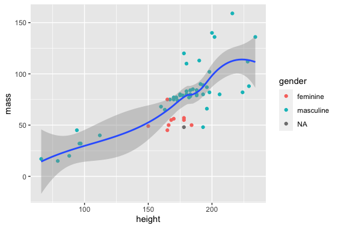

# R-Assignment 4

**Created by Sitthinon Srivimolthut (ID: 62130500095)**

Dataset: Superstore Sales Dataset (Data from Rohit Sahoo,[Kaggle](https://www.kaggle.com/rohitsahoo/sales-forecasting)) >> [Using CSV](https://raw.githubusercontent.com/safesit23/INT214-Statistics/main/datasets/superstore_sales.csv)


### Outlines
1. Explore the dataset
2. Learning function from Tidyverse
3. Transform data with dplyr and finding insight the data
4. Visualization with GGplot2

## Part 1: Explore the dataset

```
# Library
library(dplyr)
library(readr)
library(ggplot2)

# Dataset
superstore <- read_csv("https://raw.githubusercontent.com/safesit23/INT214-Statistics/main/datasets/superstore_sales.csv")
View(superstore)
```

## Part 2: Transform data with dplyr and finding insight the data

### 1. Product name ที่มีการซื้อรวมมากที่สุด
```
#Code here
```

Result:

```
#Copy Result from console to here
```
//Explain Here

### 2. 10 Top Spender
```
#Code here
```

Result:

```
#Copy Result from console to here
```
//Explain Here

### 3. การส่งสินค้ารูปแบบไหนได้รับความนิยม
```
#Code here
```

Result:

```
#Copy Result from console to here
```
//Explain Here

### 4. สินค้าที่มีราคาแพงสุด และถูกสุดที่ถูกซื้อไป
```
#Code here
```

Result:

```
#Copy Result from console to here
```
//Explain Here

### 5. ประเภทของสินค้าที่ได้รับความนิยมมากที่สุด
```
#Code here
```

Result:

```
#Copy Result from console to here
```
//Explain Here

### 6. เมืองที่มีลูกค้าซื้อมากที่สุด
```
#Code here
```

Result:

```
#Copy Result from console to here
```
//Explain Here

## Part 3: Visualization with GGplot2
### 1.) Graph show relation between height and mass
```
scat_plot <- starwars %>% filter(mass<500) %>% ggplot(aes(x=height,y=mass))+
  geom_point(aes(color=gender))

scat_plot+geom_smooth()
```
Result:


